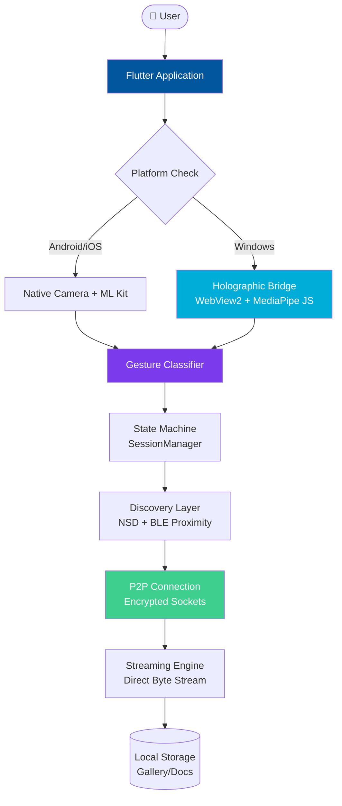
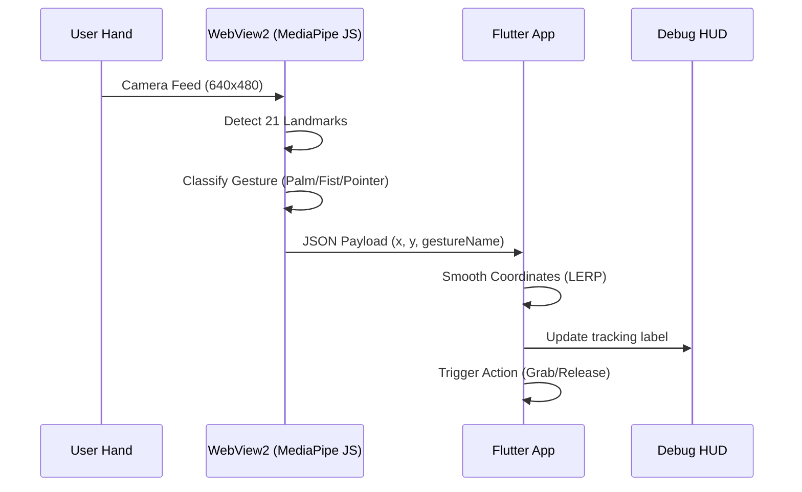

<div align="center">

# Air Shift Zero (零)

### *Shift your data, not your focus.*

**A gesture-driven, cinema-grade P2P file transfer engine that feels like magic.**

Built by **Harshal Patel**

<br/>

[](https://github.com/HarshalPatel1972/air-shift-zero)
[](https://flutter.dev)
[](https://dart.dev)
[](https://mediapipe.dev)

<br/>

> 零 — *Zero* represents the frictionless void.  
> Transfers that happen instantly, driven by the natural movement of your hands.

</div>

---

## What is Air Shift Zero?

File transfer apps usually suck. You find the file, click share, wait for discovery, confirm on the other device, and wait again. It's a series of progress bars and friction points.

**Air Shift Zero** replaces the UI with the world around you.

Using **MediaPipe-powered hand tracking** and **Secure P2P sockets**, it turns your devices into a single, shared workspace. You don't "send" files; you "grab" them from one screen and "release" them onto another. 

It’s not just a utility. It’s a holographic bridge between your digital worlds.

---

## Table of Contents

- [The Experience](#the-experience)
- [Core Features](#core-features)
- [System Architecture](#system-architecture)
- [The Gesture Pipeline](#the-gesture-pipeline)
- [Holographic Bridge (Windows)](#holographic-bridge-windows)
- [Tech Stack](#tech-stack)
- [Key Decisions & Tradeoffs](#key-decisions--tradeoffs)
- [Challenges I Hit](#challenges-i-hit)
- [Getting Started](#getting-started)
- [What I'd Improve](#what-id-improve-with-more-time)

---

## The Experience

| 1. Activate | 2. Grab | 3. Shift |
|-------------|---------|----------|
| Shake or Hotkey to trigger the frosted glass overlay | Hover to select, then make a **Fist** to lift files | Move to another device and open your **Palm** to release |

---

## Core Features

### 🖐️ Gesture-Driven Workflow
No buttons. No menus. The system uses a 21-point hand landmark model to track your index finger as a 3D cursor. 
- **Pointer**: Precision selection with real-time haptic feedback.
- **Victory (V)**: Fast-toggle between file categories.
- **Thumbs Up**: Quick-confirm transfers.
- **Fist**: The universal "Grab" action.

### 🌉 Windows Holographic Bridge
Windows lacks a native high-performance MediaPipe Flutter plugin. We built a custom **JS-WebView2 Bridge** that runs the MediaPipe vision engine in a transparent background layer, piping 30FPS landmark data directly into the Flutter host via a secure message channel.

### 🛡️ Zero-Trust Security
Each session generates a ephemeral TLS 1.3 certificate. Passwords never exist. Data is never cached. If a device leaves the BLE proximity zone, the session self-destructs.

### ⚡ P2P Direct Streaming
Files aren't uploaded then downloaded. They are streamed byte-by-byte directly over the local network using encrypted sockets. This achieves near-line-speed transfers limited only by your router.

### 💎 Cinema-Grade Aesthetics
Built with CustomPainters and Framer-style motion:
- **Frosted Glass (Glassmorphism)**: Real-time background blur.
- **Cellophane Wrap**: Visual feedback when "grabbing" files.
- **3D Cursor**: A cursor that scales and glows based on hand depth.

---

## System Architecture



---

## The Gesture Pipeline



---

## Tech Stack

### Framework & UI
| Technology | Purpose |
|-----------|---------|
| Flutter 3.x | Cross-platform UI engine |
| CustomPainter | 3D cursors and selection rings |
| Google Fonts (Inter) | Typography |
| AnimationController | Fluid, high-refresh motion |

### Gesture Engine
| Technology | Purpose |
|-----------|---------|
| MediaPipe | 21-point hand landmark tracking |
| WebView2 | Windows execution environment for JS tasks |
| ML Kit (Mobile) | Pose/Gesture detection for Android |

### Networking & Security
| Technology | Purpose |
|-----------|---------|
| mDNS (NSD) | Zero-config peer discovery |
| BLE | Proximity-based security gating |
| TLS 1.3 | Encrypted P2P streaming |
| SHA-256 | Byte-level integrity verification |

---

## Key Decisions & Tradeoffs

### WebView vs Native C++ for Windows Gestures
We chose to run MediaPipe in a WebView rather than a native C++ plugin. **Tradeoff**: Higher memory overhead. **Reason**: Rapid development and better library support for JS MediaPipe. We optimized this by keeping the WebView "headless" and limiting processing to 30FPS to save CPU.

### Proximity Gating
The app won't even show a device for transfer unless it is within BLE range. This prevents "AirDrop spam" and adds a physical layer of security to the digital transfer.

---

## Challenges I Hit

### The Windows "Namespace" Bug
MediaPipe's modern `@mediapipe/tasks-vision` bundle uses ES modules. Loading this into a Windows WebView from local assets caused silent failures because the global namespace didn't bind correctly. The fix was migrating to a strict modular script approach and using a custom `getVision()` helper to ensure library availability.

### Coordination Smoothing
Raw hand tracking data is noisy. Mapping a 640x480 camera coordinate to a 1080p screen led to "jittery" cursors. We implemented a Linear Interpolation (LERP) smoothing algorithm that balances responsiveness with cinematic stability.

---

## Getting Started

### Prerequisites
- Flutter SDK (Latest Stable)
- Windows: WebView2 Runtime installed
- Android: API 26+

### Setup

```bash
# Clone the repo
git clone https://github.com/HarshalPatel1972/air-shift-zero.git
cd air-shift-zero

# Install dependencies
flutter pub get

# Run on Windows
flutter run -d windows
```

---

## What I'd Improve With More Time

**Multi-Hand Interaction** — Using two hands to "zoom" or "fan out" files in the grid.

**File Preview Holograms** — Instead of generic icons, show a 3D-projected thumbnail of the actual file while it's being "held" in your fist.

**Desktop Hotkeys** — Customizable global triggers for Windows/macOS to activate Shift Zero from anywhere in the OS.

---

<div align="center">

**Built by Harshal Patel · April 2026**

---

*"Magic is just science we don't understand yet." — Arthur C. Clarke*

</div>
